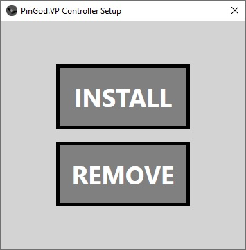

# PinGod.VP
---

A COM controller to send / receive pinball events to Godot display.

## Controller Registry

Use setup application to simplify regasm usage.



## Visual Pinball Setup

- Copy `core_c_sharp.vbs` and `PinGod.vbs` to `VisualPinball/Scripts`

- Tables must have a `PinMameTimer` and `PulseTimer` to get updates from controller. See the [BasicGame VPX][BasicGameVP Script](https://github.com/horseyhorsey/PinGod.VP.Examples/blob/master/src/BasicGame/BasicGameVisualPinball) 

## Examples

See Visual Pinball directories in games folder for examples [Examples](https://github.com/horseyhorsey/PinGod.VP.Examples)

[BasicGameVP Script](https://github.com/horseyhorsey/PinGod.VP.Examples/blob/master/src/BasicGame/BasicGameVisualPinball/PinGodVp-BasicGame-VPX10-6.vbs)

[MoonStationVP Script](https://github.com/horseyhorsey/PinGod.VP.Examples/blob/master/src/MoonStation/MoonStationVisualPinball/MoonStation%20(PinGod)-VPX10-6.vbs)

## VP Controller Methods

### ChangedSolenoids
---

`Const UseSolenoids = 1 ' Check for solenoid states?`

### ChangedLamps
---

`Const UseLamps = 1  ' Check for lamp states?`

*Must be excplitly set to 0 if not using them and want to save some process*

### ChangedPDLeds
---

`Const UsePdbLeds = 1  ' Check for led states?`

*Must be excplitly set to 0 if not using them and want to save some process*

See `core_c_sharp.vbs`

### Run

`RunDebug GetPlayerHWnd, GameDirectory` Runs `godot` with the given project directory

`Run GetPlayerHWnd, GameDirectory` Runs an exported game executable without debug.

### Display Properties
---

```
	public bool DisplayFullScreen { get; set; }
	public int DisplayWidth { get; set; }
	public int DisplayHeight { get; set; }
	public int DisplayX { get; set; }
	public int DisplayY { get; set; }
	public bool DisplayAlwaysOnTop { get; set; }
	public bool DisplayLowDpi { get; set; }
	public bool DisplayNoWindow { get; set; }
	public bool DisplayNoBorder { get; set; }
	public bool DisplayMaximized { get; set; }
```	

Visual Pinball Example:

```
	With Controller
	.DisplayX			= 10
	.DisplayY			= 10
	.DisplayWidth 		= 512 ' 1024 Original W
	.DisplayHeight 		= 300 ' 600  Original H
	.DisplayAlwaysOnTop = True
	.DisplayFullScreen 	= False 'Providing the position is on another display it should fullscreen to window
	.DisplayLowDpi 		= False
	.DisplayNoWindow 	= False
```

### Extra Machine Items
---

By default the memory is allocated a set number of items.

- Coils = 34, Lamps = 64, Leds  = 64, Switches = 128

If you want to increase you can add properties like the above display properties.

```
With Controller
.LampCount			= 81
.LedCount			= 72
.CoilCount			= 63
```

### Pause
---

VP `Controller.Pause 1`

Runs `SetAction` to send `pause` to Godot

### SetAction
---

VP: `Controller.SetAction "my_custom_action", 1`

Create an action in the `InputMap` settings inside godot and invoke this.

### Stop
---

VP `Controller.Stop`

### Switch
---

`Controller.Switch 69, 1`

`Controller.Switch 69, 0`

`vpmPulseSw 69`